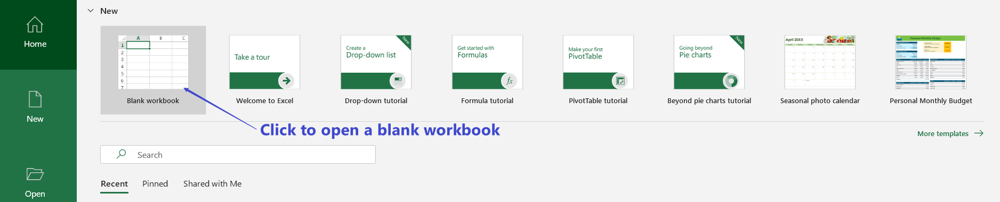
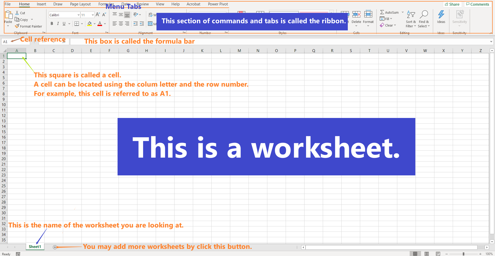

## Getting Start

- When you run the Microsoft Excel app, you likely will see the following startup screen.

- After open an black workbook, the screen with a grid you see is a worksheet. Worksheets are part of a workbook with a file name like book1.xlsx, but you can rename it to any file name when you save your file.

- In a worksheet, you will see the following things.
  - **Cell** A cell is a rectangular block in a worksheet. A cell is a storage box that holds information you entered. An active Cell is one that is currently being editing.
  - **Columns and Rows** Columns and rows are used to locate cells.
  - **Column and Row headings** Columns and rows are labeled by letters and numbers which are called headings. Clicking on a heading will select the entire row or column.
  - **Ribbon** Above a workbook is a section of commands and tabs called the Ribbon.
  - <a name="cell_reference">**Cell Reference**</a> A cell reference is a combination of the column letter and the row number. For example, A1 refers to the cell located at where column A and row 1 intersect.
  - **Formula Bar** Between the ribbon and column heading, one will find the formula bar. The Formula Bar will display the content of an active cell.

## Selecting, Referring to, and Formatting Cells

- Excel has some formatting options that can be used change the appearance of cells. To format cells, you have to highlight (select) those cells that you want to format.
  - To select cells in a rectangular region, first select a cell in a corner of the region, then **either**
    - hold the left-click button of the mouse and drag to the diagonal corner of the region, **or**
    - click and hold the `Shift` key and the keyboard and then select the cell in the diagonal corner of the region.
  - To select several cells in different regions, you can click hold the `Ctrl` (`Cmd` on Mac) key on the keyboard and then select the cells using the mouse.

  **Superuser Tips:** Holding `Ctrl` and using drag to select can select multiple regions.

- Cells can be referred using their [references](#cell_reference). In formulas, to refer to multiple cells, you can use the above mentioned selecting method or type in cell references. For cells in a range, Excel uses `:` to mean the word "to". For example,  cells from A1 to A10 can be written as `A1:A10` in an Excel formula. For a collections of individual cells, Excel uses  `,` to separate them. For example, `A1,A3,A4,A6`. 

  **Superuser Tips:** Column and row headings are variables. Excel can automatically produce data in continued blank cells according the formulas (pattern) in previous cells. To tell Excel to fix a column heading or row heading or cell reference in a formula, we add the `$` sign in front of the column heading and/or the row heading. For example, `$A$1` is an absolute cell reference.

- Excel has many built-in functions for formatting cells. You may find those formatting commands in the ribbon. One of the those formatting commands that we will is to merge cells. Note that merging cell only keeps the upper-left value and discords other values.
  
  **Example:** To merge the cell `A1` to `B1` into one cell and center the text, we select those two cells and then click to run the command `Merge & Center` under the `Home` tab. Suppose that `A1` and `B1` have the values "Merge" and "cell", after merging, only the value "Merge" will be kept in the merged cell.
  
  

## Formulas and Operators

- A **formula** is an expression inside a cell that is used to produce a value. A formula must begin with an equal `=` sign which tells Excel to evaluate the expression and produce a value. A formula could be a mathematical expression, cell references, or Excel functions.

- **Excel functions** are pre-built formulas in Excel. Here are a few examples

  | **Formula**    | **Performance**                                                  |
  | :------------- | :----------------------------------------------------------- |
  | `average()`    | Calculate the average of a group of numbers |
  | `sum()`             | Calculate the total of a group of numbers |
  | `round()`             | Round a number |

- **Operators** are symbols or signs that indicate how calculation should be done in an expression. In Excel, operators includes not only arithmetic operators but also text concatenation, logical and reference operators. For example, the text concatenation of "Tool" and "box" can be done by `"Tool"&"box"`. The following are tables of Excel operators by their types.

  - Arithmetic Operators and their order of operations

  | Operator | Description                 | Order of Operation (smaller number= higher priority) |
  | :------: | :-------------------------- | :--------------------------------------------------: |
  |    `%`     | The percent operator        |                          1                           |
  |    `^`     | The exponentiation operator |                          1                           |
  |    `*`     | The multiplication operator |                          2                           |
  |    `/`     | The division operator       |                          2                           |
  |    `+`     | The addition operator       |                          3                           |
  |    `-`     | The subtraction operator    |                          3                           |
  
  - Text concatenation

    | Operator | Description                 |
    | :------: | :-------------------------- |
    | `&` |  Combine text strings |

  - Logical operators

    | Operator | Description              |
    | :------: | :----------------------- |
    |    =     | Equal to                 |
    |    >     | Greater than             |
    |    <     | Less than                |
    |    >=    | Greater than or equal to |
    |    <=    | Less than or equal to    |
    |    <>    | Not equal to             |

  - Reference Operators

    | Operator | Description                                                  |
    | :------: | :----------------------------------------------------------- |
    |    :     | Range operator (defines a reference to a range of cells)     |
    |    ,     | Union operator (combines two references into a single reference) |
    | (space)  | Intersection operator (returns a reference to the intersection of two ranges) |

## Autofill

Autofill helps to generate data for consecutive cells using formula(s) (pattern) in previous cells. To use autofill, select the cell(s) that have formulas (pattern) that you want to use to autofill other cells. Move the cursor to the lower right corner of the selected region and you will see a black solid plus sigh **`+`**. Drag the plus sign to a nearby cell will autofill a formula/datum.

**Example:** Suppose that you want to fill in the first 10 natural numbers in cells A1 to A10. You may enter 1, 2 in A1 and A2 respectively. Then select A1 and A2. Now move the mouse cursor to the lower right corner of the A2 cell and drag the solid plus sign **`+`** to the cell A10 will generate the numbers.

## Homework 1

**Assignment:** Create a table in Excel with 11 rows and 10 columns that has the following values in it.

1. Merge the first row in the table and enter the text "First 100 numbers in a 10 by 10 table".
2. Fill in the first 100 numbers from left to right and top to bottom as shown in the following picture.

**Requirement:** You must submit your work in excel using the link in Blackboard.
